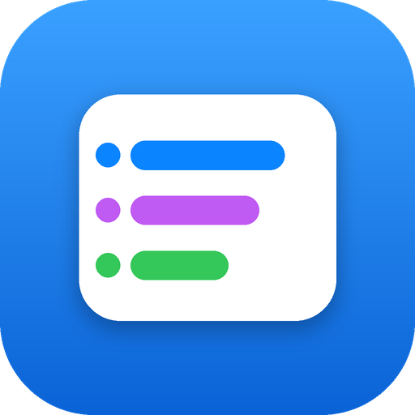

# JIT Class Schedule — Fall 2026–2027

An installable **Progressive Web App (PWA)** of the class timetable for **Jinling Institute of Technology (金陵科技学院)**. It works offline, installs to your home screen like a native app, and helps you set up reminders so you never sleep through a class.

<p align="center">
  
</p>

## Features

- **Week view & Day view** — switch between a full Monday–Friday grid and a phone-friendly agenda.
- **Per-week filtering (Weeks 1–18)** — tap a week and the schedule updates; classes that only run certain weeks (e.g. the Week 17 project block) appear only when relevant.
- **Tap any class** for exact times, period numbers, teaching weeks, room, and building.
- **Category filters** and live stats (courses, sessions, contact hours, busiest day).
- **Reminders panel** — set your reminder lead time, export the whole schedule as a `.ics` calendar file (with alerts, aware of week-specific classes), and get a ready-made list of Clock-app alarm times.
- **Correct bell schedule** — all 11 periods with real 45-minute time slots.
- **Offline-first** — after the first visit it loads with no internet.
- **Light & dark mode** — follows your device setting automatically.

## Live demo

After deploying (see below), your app will be at:

```
https://<your-username>.github.io/<your-repo>/
```

## Deploy to GitHub Pages

1. **Create a new repository** on GitHub (public), e.g. `jit-schedule`.
2. **Add these files** to the repository root (keep the folder structure):
   - either drag-and-drop them in the GitHub web UI (**Add file → Upload files**),
   - or push from your computer:
     ```bash
     git init
     git add .
     git commit -m "JIT schedule PWA"
     git branch -M main
     git remote add origin https://github.com/<your-username>/<your-repo>.git
     git push -u origin main
     ```
3. In the repo, go to **Settings → Pages**.
4. Under **Build and deployment → Source**, choose **Deploy from a branch**.
5. Select branch **main** and folder **/ (root)**, then **Save**.
6. Wait ~1 minute, then open `https://<your-username>.github.io/<your-repo>/`.

> All paths in this project are **relative**, so it works whether it's served from a
> user site (`username.github.io`) or a project sub-path (`username.github.io/repo/`).

## Install it on your phone

- **iPhone (Safari):** open the site → Share → **Add to Home Screen**.
- **Android (Chrome):** open the site → menu (⋮) → **Install app** / **Add to Home screen**.

Once installed it opens full-screen with its own icon, and works offline.

## Set up reminders (so you don't oversleep)

Open the **🔔 Reminders & wake-up alarms** panel in the app:

1. Set **Week 1 starts** to your real first Monday of the semester.
2. Pick how long **before class** you want to be reminded.
3. **Download the `.ics`** and open it on your phone to add every class (with alerts) to your Calendar.
4. Use the generated **alarm time list** to set loud alarms in your **Clock app** — these override silent mode and can wake you, which calendar alerts can't reliably do.

## File structure

```
.
├── index.html               # the app
├── manifest.webmanifest     # PWA manifest (name, icons, colors)
├── sw.js                    # service worker (offline caching)
├── .nojekyll                # tells GitHub Pages to serve files as-is
├── README.md
└── icons/
    ├── favicon.svg
    ├── favicon-16.png
    ├── favicon-32.png
    ├── apple-touch-icon.png     # 180×180 (iOS)
    ├── icon-192.png             # PWA (any)
    ├── icon-512.png             # PWA (any)
    ├── icon-192-maskable.png    # PWA (maskable / Android adaptive)
    └── icon-512-maskable.png    # PWA (maskable / Android adaptive)
```

## Updating the app

The service worker caches files for offline use. When you change anything, bump the
cache version in **`sw.js`** so browsers fetch the new version:

```js
const CACHE = 'jit-schedule-v2'; // was v1
```

## Notes

- Class times in the `.ics` are written in your **device's local time**. If your phone's
  timezone differs from campus (China Standard Time, UTC+8), adjust accordingly.
- No tracking, no external requests, no server — everything runs in the browser.

## License

MIT — free to use, modify, and share.
